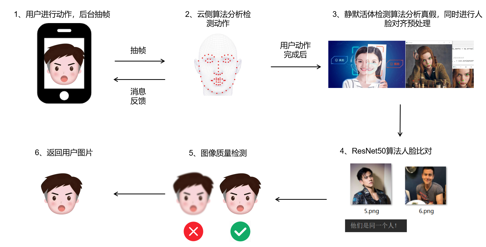

## 一、大概技术要点

1. FasNet做spoofing伪造欺骗
2. 通过阈值变化做眨眼、张嘴、摇头检测
3. YOLOv8进行人脸检测与位置矫正
4. ResNet进行人脸比对确保检测过程始终是同一个人
5. 网页端使用伪造证书用来打开摄像头权限
6. 基于websocket保持服务端和客户端的连接并实时响应
7. 基于uvicorn并发，使用session_id和队列queue区分不同人的图片

## 二、算法流程



## 三、安装使用

**1、权重文件提取：**

通过网盘分享的文件：weights
链接: https://pan.baidu.com/s/1L6gT9mOQf7EjcA9v1CP3-A 提取码: r1b7

**2、环境安装**

```
pip install -r requirements.txt -i https://pypi.tuna.tsinghua.edu.cn/simple
```

**3、配置伪造证书**

参考链接：https://blog.csdn.net/guigenyi/article/details/131424405

和 https://www.cnblogs.com/ioufev/articles/16769063.html

**4、项目启动**

```
python AppStart.py
```

项目运行端口为8000，访问为https：//ip：8000/web/，示例如下：

```
https://192.168.31.24:8000/web/
```